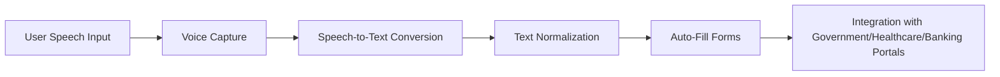

# Voice2Form 🎙️➡️📄

## 🔹 Project Overview
Voice2Form is an **ML-powered voice-to-text system** designed to help **rural and uneducated people** access digital services such as **government portals, healthcare systems, and banking applications**.  
The system converts **regional language speech (Tamil, Hindi, Telugu, etc.) into accurate text** and automatically **fills forms and records**, making public services more inclusive, faster, and easier to use.

---

## 🔹 Problem Statement
Many rural citizens in India struggle with:
- **Typing in English** on digital platforms.
- **Limited literacy** in official languages used by government/healthcare/banking portals.
- **Difficulty accessing essential services** due to language and technology barriers.

This creates a **digital divide**, excluding a large section of society from online public services.

---

## 🔹 Proposed Solution
Voice2Form provides a **local language voice interface** that:
1. Accepts **speech input** in regional languages.  
2. Converts it into **clean and normalized text** using ML/NLP techniques.  
3. Integrates with service portals to **auto-fill forms** and records.  

✅ This ensures **digital inclusion**, **faster service delivery**, and **equal access for all**.

---

## 🔹 Dataset
- **Custom synthetic dataset** created with **1500+ rows and 15+ columns**.  
- Includes: `utterance_id`, `audio_filepath`, `transcription`, `language`, `intent`, `service_domain`, `speaker_id`, `region`, etc.  
- Supports **Tamil, Hindi, and Telugu** languages.  
- Real-world datasets considered: **Mozilla Common Voice, IndicTTS, FLEURS, OpenSLR**.  

---

## 🔹 Preprocessing Steps
1. **Load Dataset** → Import CSV file with audio-text pairs.  
2. **Clean Data** → Remove missing/duplicate entries.  
3. **Normalize Text** → Unicode correction, whitespace cleanup, consistent formatting.  
4. **Split Dataset** → Train (80%), Validation (10%), Test (10%).  

Manifests are saved in **JSONL format** for ASR training.

---

## 🔹 Workflow

## 🔹 Tech Stack
- **Languages:** Python
- **Libraries:** Pandas, Scikit-learn, JSON, Regex, Torchaudio/Librosa (for audio)
- **ML Models:** ASR models (Whisper, Wav2Vec2, Indic ASR models)
- **Data Sources:** Mozilla Common Voice, IndicTTS, FLEURS

---

## 🔹 Conclusion

**Voice2Form** bridges the digital accessibility gap by enabling **rural and uneducated citizens** to interact with essential online services using their own language and voice.
This solution ensures inclusive growth, faster service access, and contributes towards Digital India initiatives.

---

## 🔹 Futute Enhancements

- Add support for more **Indian languages**.
- Improve accuracy with **domain-specific fine-tuning**.
- Enable **offline functionality** for areas with poor connectivity.
- Deploy as a **mobile/web app** for real-world use.
